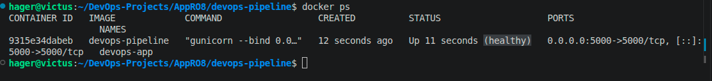

# DevOps Pipeline

A containerized Flask web application with Docker, Docker Compose, environment-based configuration, automated testing, and Prometheus monitoring.

## Project Overview

This project demonstrates a simple DevOps workflow for a Flask web application.

The project includes:

* Flask web application
* Docker containerization
* Docker Compose for multi-container deployment
* Environment variable configuration
* Automated testing with Pytest
* Container health checks
* Prometheus monitoring
* GitHub Actions CI/CD

## Architecture

```text
                    DevOps Pipeline
                         │
             ┌───────────┴───────────┐
             │                       │
        Flask App                Prometheus
       Container                 Container
        Port 5000                 Port 9090
             │                       │
             │ /metrics              │
             └───────────────────────┘
                    Docker Network
```



## Project Structure

```text
devops-pipeline/
├── app/
│   ├── app.py
│   └── requirements.txt
├── tests/
│   └── test_app.py
├── monitoring/
│   └── prometheus.yml
├── .github/
│   └── workflows/
│       └── ci-cd.yml
├── .env.example
├── .gitignore
├── Dockerfile
├── docker-compose.yml
├── image.png
├── pytest.ini
└── README.md
```

## Application Endpoints

| Endpoint   | Description               |
| ---------- | ------------------------- |
| `/`        | Main application endpoint |
| `/health`  | Application health check  |
| `/metrics` | Prometheus metrics        |

## Prerequisites

Make sure the following are installed:

* Git
* Docker
* Docker Compose
* Python 3.12 or later

Check the installations:

```bash
git --version
docker --version
docker compose version
python3 --version
```

## Local Setup

Clone the repository:

```bash
git clone https://github.com/YOUR-USERNAME/devops-pipeline.git
cd devops-pipeline
```

## Environment Configuration

Create a `.env` file in the project root:

```env
APP_ENV=staging
LOG_LEVEL=INFO
```

The `.env` file is used for local configuration and should not be committed to Git.

An `.env.example` file is provided as a configuration template.

## Run with Docker Compose

Build and start the application:

```bash
docker compose up -d --build
```

Check the running containers:

```bash
docker compose ps
```

The application should be available at:

```text
http://localhost:5000
```

Prometheus should be available at:

```text
http://localhost:9090
```

## Health Check

The application provides a health endpoint:

```text
http://localhost:5000/health
```

Expected response:

```json
{
  "status": "ok"
}
```

Docker also performs an automatic health check against this endpoint.

## Monitoring

Prometheus collects metrics from the Flask application through:

```text
http://app:5000/metrics
```

The Prometheus configuration is located at:

```text
monitoring/prometheus.yml
```

Prometheus uses the Docker Compose service name `app` to communicate with the Flask container.

To check the Prometheus target:

1. Open `http://localhost:9090`
2. Go to **Status**
3. Open **Target health**
4. Verify that the application target is **UP**

## Automated Tests

The project uses Pytest.

Create and activate a virtual environment if needed:

```bash
python3 -m venv .venv
source .venv/bin/activate
```

Install dependencies:

```bash
pip install -r app/requirements.txt
```

Run the tests:

```bash
pytest
```

The tests verify the main application and health endpoint.

## Docker Image

Build the Docker image manually:

```bash
docker build -t devops-pipeline .
```

Run the container:

```bash
docker run -d \
  --name devops-app \
  -p 5000:5000 \
  devops-pipeline
```

Check the container:

```bash
docker ps
```

Stop and remove it when finished:

```bash
docker stop devops-app
docker rm devops-app
```

## CI/CD

GitHub Actions is used to automate the CI/CD process.

The workflow is located at:

```text
.github/workflows/ci-cd.yml
```

The pipeline is designed to:

1. Checkout the source code
2. Set up Python
3. Install dependencies
4. Run automated tests
5. Build the Docker image
6. Deploy the application to staging
7. Verify the deployment

The workflow runs automatically when changes are pushed to the main branch or when a pull request is opened.

## Configuration

The main configuration values are:

| Variable    | Description               | Example   |
| ----------- | ------------------------- | --------- |
| `APP_ENV`   | Application environment   | `staging` |
| `LOG_LEVEL` | Application logging level | `INFO`    |

Sensitive configuration should be stored using environment variables or GitHub Actions Secrets rather than being committed to the repository.

## Stopping the Application

To stop all services:

```bash
docker compose down
```

To rebuild the application:

```bash
docker compose up -d --build
```

## Troubleshooting

Check the application logs:

```bash
docker compose logs app
```

Check Prometheus logs:

```bash
docker compose logs prometheus
```

Check the status of all services:

```bash
docker compose ps
```

Check the application health endpoint:

```bash
curl http://localhost:5000/health
```

Check the metrics endpoint:

```bash
curl http://localhost:5000/metrics
```

## Submission Links

### GitHub Repository

Add the final repository URL here:

```text
https://github.com/YOUR-USERNAME/devops-pipeline
```

### Live / Staging Application

Add the deployed application URL here after cloud deployment:

```text
https://YOUR-STAGING-URL
```

### Monitoring

Add the Prometheus or monitoring URL if it is publicly accessible:

```text
https://YOUR-MONITORING-URL
```

## Reviewer Access

All submitted links and supporting materials should be publicly accessible or shared with the required reviewer permissions.

The repository should contain all required:

* Source code
* Docker files
* Docker Compose configuration
* Tests
* CI/CD workflow
* Monitoring configuration
* Environment configuration template
* Documentation


